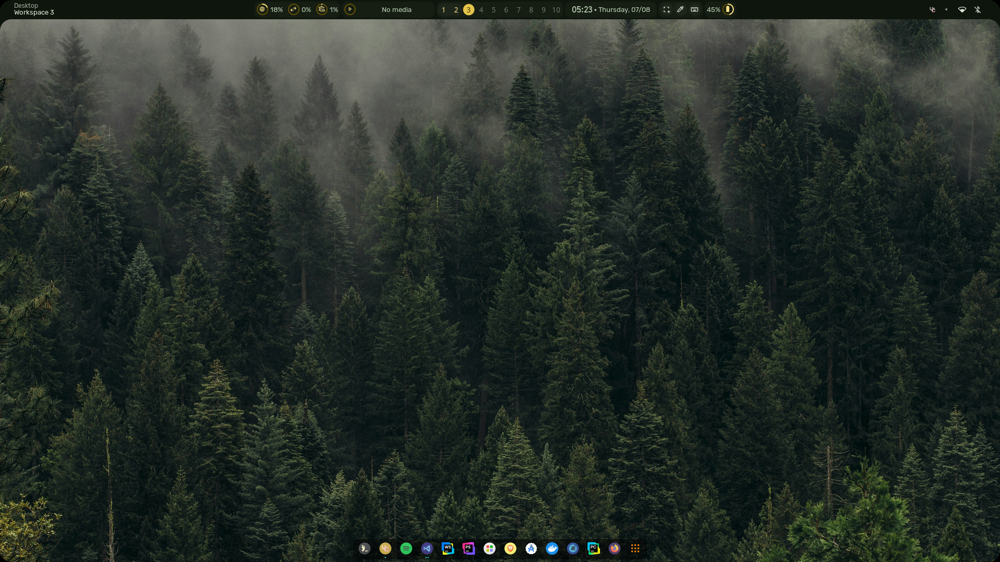

# nwg-dock-hyprland Configuration Guide

This guide explains how to configure `nwg-dock-hyprland` for Hyprland.

## 1. Autostart and Keybinding

Add the following lines to your Hyprland config (usually `~/.config/hypr/hyprland.conf`) to start the dock automatically and bind a key to restart it:

```ini
# Run nwg-dock once after a 3-second delay on startup
exec-once = sleep 3 && nwg-dock-hyprland -x -p bottom -i 32 -ml 10 -mr 10 -mb 5 -mt 5

# Bind ALT + SHIFT + H to restart the dock manually
bind = ALT SHIFT , H , exec, nwg-dock-hyprland -x -p bottom -i 32 -ml 10 -mr 10 -mb 5 -mt 5
```

## 2. Layer Rules

Add these layer rules to ensure proper dock behavior:

```ini
layerrule = blur ,gtk-layer-shell
layerrule = ignorezero ,gtk-layer-shell
```

## 3. Appearance Customization

You can customize the appearance of the dock by editing the CSS file:

```sh
nano ~/.config/nwg-dock-hyprland/style.css
```

Adjust colors, spacing, and other styles as needed.

## 4. Additional Resources

- [nwg-dock-hyprland GitHub](https://github.com/nwg-piotr/nwg-dock-hyprland)
- [Hyprland Wiki](https://wiki.hyprland.org/)

---